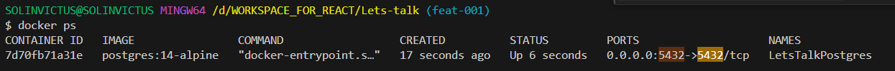

# README
## To run POSTGRES in docker

```bash
docker pull postgres:14-alpine

docker start LetsTalkPostgres

docker exec -it LetsTalkPostgres bash
psql -U letstalkUSER

# Other additional commands
passwd postgres
passwd <username>

su - postgres
su - <username>

whoami

cat /etc/passwd


psql -h 127.0.0.1 -p 5432 -U letstalkUSER -d letstalkDB

```

## To run knex commands
Important link for [Knex](https://devhints.io/knex)
```bash
cd db-script
knex migrate:make <users>
knex migrate:latest --migrations-directory ./migrations/ --knexfile ./knexfile.js

```
## UP:
### for running FE
`make start-app`

### for data setup
```bash
make db-start
cd db-script 
npm run build
knex migrate:latest --migrations-directory ./migrations/ --knexfile ./knexfile.js
```

### for running backend
`make start-backend`


## DOWN:
### for removing database and data
```bash
make db-remove
docker volume rm pgdata
```
## HMR for faster builds
### Changes related to HMR are influenced from below blog
https://csotiriou.medium.com/speed-up-nodejs-server-side-development-with-webpack-4-hmr-8b99a932bdda
### dependencies used
npm-run-all - *A CLI tool to run multiple npm-scripts in parallel or sequential.*
node-dev - *Node-dev is a development tool for Node.js that automatically restarts the node process when a file is modified. In contrast to tools like supervisor or nodemon it doesn't scan the filesystem for files to be watched. Instead it hooks into Node's require() function to watch only the files that have been actually required..*
cross-env - *cross-env makes it so you can have a single command without worrying about setting or using the environment variable properly for the platform. Just set it like you would if it's running on a POSIX system, and cross-env will take care of setting it properly.*


## ESLint
ESLint is a tool for identifying problematic patterns found in JavaScript 

```bash
npx eslint --init # this is easy way
# OR
npm install eslint @eslint/js globals --save-dev # here you need to create eslint.config.js file manually
```
## Mkdocs
```bash
pip install -r requirements.txt
mkdocs serve
```

```java
// Java code to test plugin changes
class A{
    public static void main(String[] args) {
        System.out.println("Hello World");
    }
}
```